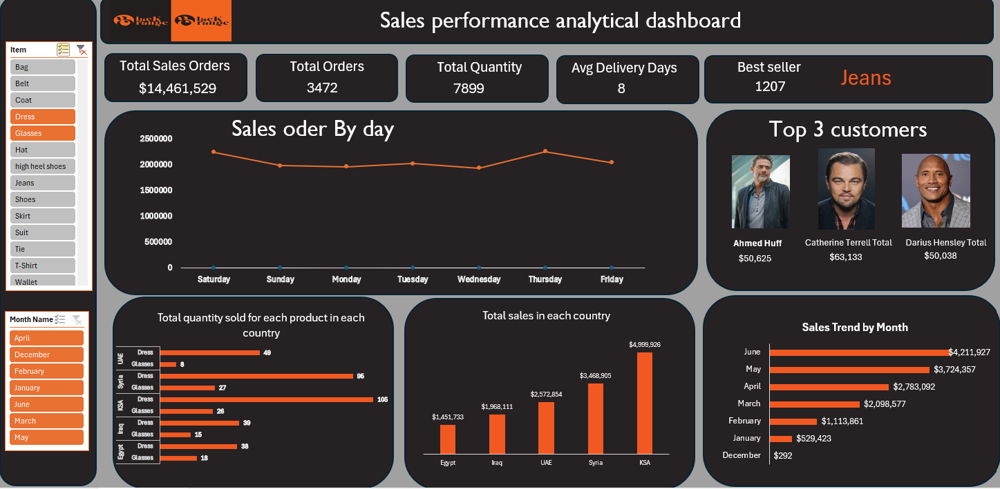

# Sales Performance Analytics - Excel

## Project Overview

This project is an interactive sales performance dashboard built in Microsoft Excel.

I created the dashboard to bring the main sales indicators into one view and make it easier to analyze sales performance by product, customer, country, month, and day.

## Dashboard Overview

The dashboard provides a quick view of overall sales performance through key metrics including:

- Total Sales Value
- Total Orders
- Total Quantity Sold
- Average Delivery Days
- Best-Selling Product

## Sales Analysis

The dashboard provides different views of sales performance, including:

- Sales orders by day
- Monthly sales trends
- Sales by country
- Product quantities sold by country
- Best-selling product
- Top customers by sales value

## Interactive Analysis

I added interactive filters for product and month, allowing the dashboard to be explored based on selected criteria.

This makes it easier to compare performance across products and different periods without changing the underlying data.

## Tools Used

- Microsoft Excel
- PivotTables
- PivotCharts
- Slicers
- Excel Formulas
- Data Cleaning
- Dashboard Design

## What I Worked On

For this project, I prepared and organized the sales data, created the required calculations and PivotTables, and built the dashboard in Excel.

I used PivotCharts and slicers to make the report interactive and designed the dashboard to provide a clear view of sales trends, customer performance, product performance, and geographic sales distribution.
